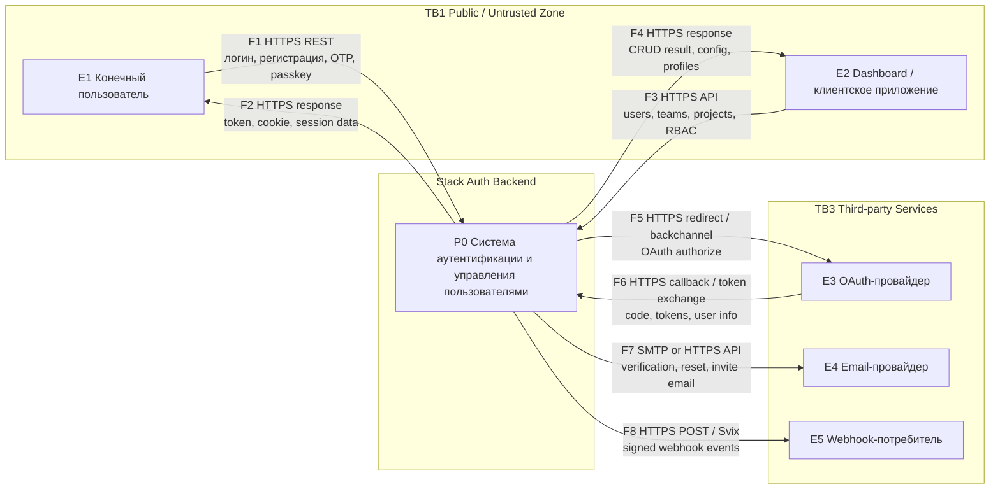
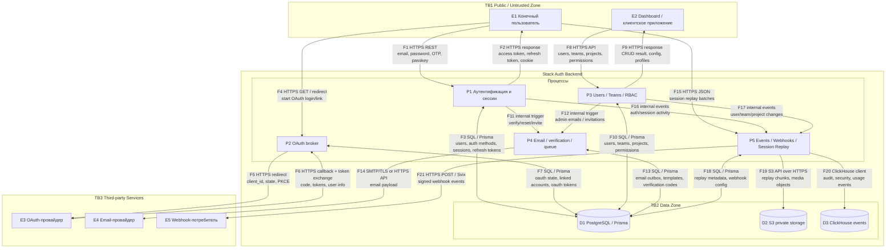

# DFD for Stack Auth

Основа анализа: в качестве исследуемой системы берется `apps/backend` проекта Stack Auth, так как именно там реализованы маршруты аутентификации, OAuth, email-очередь, webhooks, session replay, работа с PostgreSQL, S3 и ClickHouse.

Подтверждающие участки кода:
- `stack-auth/apps/backend/package.json`
- `stack-auth/apps/backend/src/app/api/latest/auth/password/sign-in/route.tsx`
- `stack-auth/apps/backend/src/app/api/latest/auth/oauth/authorize/[provider_id]/route.tsx`
- `stack-auth/apps/backend/src/app/api/latest/auth/oauth/callback/[provider_id]/route.tsx`
- `stack-auth/apps/backend/src/lib/emails.tsx`
- `stack-auth/apps/backend/src/lib/webhooks.tsx`
- `stack-auth/apps/backend/src/s3.tsx`
- `stack-auth/apps/backend/src/lib/events.tsx`

Этот файл можно вставить в Mermaid Live Editor или в diagrams.net:
- Mermaid Live Editor: https://mermaid.live/
- diagrams.net: Insert -> Advanced -> Mermaid

## Контекстная DFD

## DFD Уровня 1

## Идентификаторы

- Внешние сущности: `E1`, `E2`, `E3`, `E4`, `E5`
- Процессы: `P0` для контекстной диаграммы; `P1`-`P5` для уровня 1
- Хранилища: `D1`, `D2`, `D3`
- Границы доверия: `TB1`, `TB2`, `TB3`
- Потоки данных: `F1`-`F21`

## Что делать дальше

- Если преподаватель требует строгую контекстную DFD, на контекстной диаграмме оставить только `P0` и внешние сущности.
- Если преподаватель требует единый номер процесса, можно заменить `P0` на `P1`, а на уровне 1 использовать `P1.1`-`P1.5`.
- Для отчета рядом с диаграммой стоит добавить таблицу потоков `F1-F21` с типом данных, направлением, протоколом и уровнем доверия источника.
